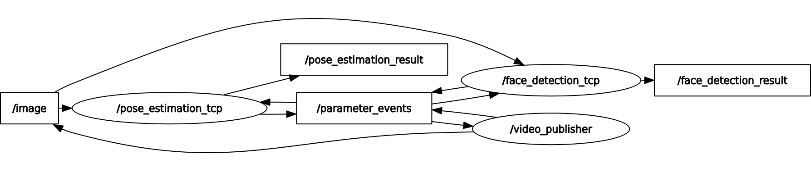

# ROS2tcp
[FPGA-Based-EdgeAI-Prototypes](https://github.com/DYGV/FPGA-Based-EdgeAI-Prototypes/)のTCPサーバとの通信をROS 2ノード内で行うパッケージ  

https://github.com/DYGV/ros2tcp-edgeAI/assets/8480644/545b7924-9846-4fd9-8228-a07ef007d903




## ROS 2パッケージ起動手順
### image publisher  
`image`トピックに画像データをPublishするパッケージ  
```
ros2 run video_sender video_publisher --ros-args -p video_file:=/dev/video0 -p hz:=30
```  
## face\_detection\_tcp
`image`トピックをSubscribeし、顔検出のTCPサーバへ画像送信・結果受信し、結果を`face_detection_result`トピックへPublishするパッケージ  
```
ros2 run face_detection_tcp face_detection_tcp --ros-args -p server_addr:=192.168.0.2 -p server_port:=54321 -p show_gui:=true
```  
## pose\_estimation\_tcp
`image`トピックをSubscribeし、姿勢推定のTCPサーバへ画像送信・結果受信し、結果を`pose_estimation_result`トピックへPublishするパッケージ  
```
ros2 run pose_estimation_tcp pose_estimation_tcp --ros-args -p server_addr:=192.168.0.163 -p server_port:=54321 -p show_gui:=true
```  
